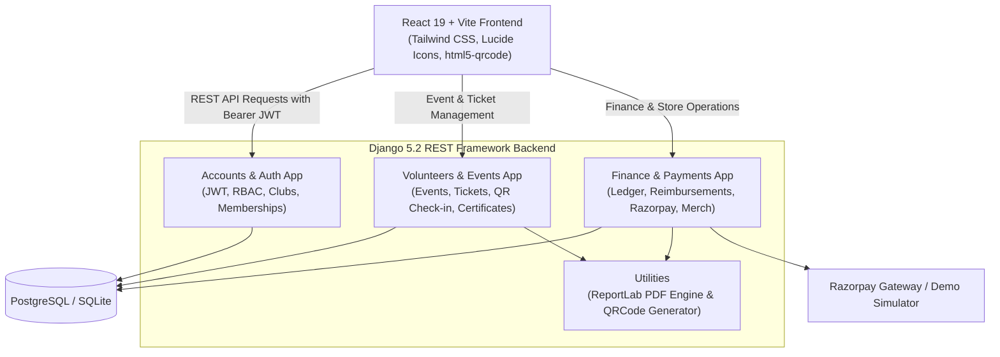

# 🏛️ SkyLine — Student Organization Management System

[](https://www.python.org/)
[](https://www.djangoproject.com/)
[](https://www.django-rest-framework.org/)
[](https://react.dev/)
[](https://vitejs.dev/)
[](https://tailwindcss.com/)

> **SkyLine** is a modern, enterprise-grade university student organization and campus club management platform. It streamlines the complete student lifecycle — from club admissions and dynamic QR event ticketing to volunteer role assignments, cryptographic certification, campus merchandise distribution, and treasurer financial accounting.

---

## 📑 Table of Contents

- [Key Features](#-key-features)
- [System Architecture](#-system-architecture)
- [Roles & Permissions (RBAC)](#-roles--permissions-rbac)
- [Repository Structure](#-repository-structure)
- [Getting Started](#-getting-started)
  - [Prerequisites](#prerequisites)
  - [1. Backend Setup (Django & DRF)](#1-backend-setup-django--drf)
  - [2. Frontend Setup (React & Vite)](#2-frontend-setup-react--vite)
- [Pre-configured Demo Accounts](#-pre-configured-demo-accounts)
- [Key API Endpoints](#-key-api-endpoints)
- [Testing & Quality Assurance](#-testing--quality-assurance)
- [Environment Configuration](#-environment-configuration)
- [Contributing](#-contributing)
- [License](#-license)

---

## ✨ Key Features

### 🔐 Authentication & Role-Based Access Control (RBAC)
- **Multi-Role User Architecture**: Custom User model supporting **Student / Member**, **Club Admin (Faculty / Officer)**, and **Treasurer** personas.
- **JWT Security**: Token-based authentication via `djangorestframework-simplejwt` with token rotation and server-side token blacklisting upon logout.
- **Password Governance**: Secure password reset flow with cryptographic `uidb64` and timed reset tokens.

### 🎟️ Campus Events & Dynamic QR Ticketing
- **Event Lifecycle**: Complete event publishing, attendee capacity tracking, date/venue scheduling, and status handling (`Draft`, `Published`, `Completed`, `Cancelled`).
- **Tiered Pricing**: Automatic discount calculation for registered club members vs. general university attendees.
- **Dynamic Digital Passes**: Unique cryptographic QR codes for every admission pass, with public verification URLs and live check-in timestamps.
- **PDF Generation**: Instant download of official, high-resolution admission passes rendered dynamically using `ReportLab`.
- **Gate Check-in Scanner**: Integrated webcam/mobile camera QR scanner (`html5-qrcode`) for real-time ticket validation and entry tracking.

### 🤝 Volunteer Management & Verifiable Certificates
- **Application Portal**: Students can apply for specific volunteer roles (Registration, Tech Support, Stage Management, Photography, Hospitality) with statement of interest.
- **Admin Review Queue**: Dedicated admin workflow to review applications, approve/reject with custom feedback, and create active volunteer assignments.
- **Institutional Certificates**: Automated generation of official volunteer certificates with unique IDs (`CERT-YYYY-XXXX`) and SHA-256 verification hashes.

### 💰 Finance, Ledger & Reimbursement Workflow
- **Financial Accounting Ledger**: Double-entry ledger recording all income (memberships, event passes, merchandise, fundraisers) and expenditures.
- **Reimbursement Processing**: Students and officers submit expense claims with uploaded receipts; Treasurers review, approve, and disburse payouts.
- **Automatic Ledger Sync**: Approving and paying a reimbursement automatically writes a corresponding `EXPENSE` entry to the organization ledger.
- **Payment Gateway Integration**: Multi-mode payment engine supporting both **Razorpay** (order creation, signature validation, webhooks) and a built-in **Demo Payment Simulator** for testing.

### 🛍️ Campus Merchandise Catalog & Fulfillment
- **Official Gear Catalog**: Apparel, badges, and accessories with variant-level stock management (per-size quantities).
- **Digital Collection Passes**: Generates secure merchandise collection passes with unique QR tokens.
- **Fulfillment Desk Scanner**: Desk officers scan student QR tokens to verify paid orders and record collection timestamps.

### 📢 Institutional Announcements
- **Campus Broadcasts**: Admin-published notices categorized by priority (`Urgent`, `Official`, `Important`, `Normal`).
- **Target Channels & Scheduling**: Supports targeted student cohorts, delivery stats tracking, and pinned priority alerts.

---

## 🏗️ System Architecture



---

## 👥 Roles & Permissions (RBAC)

| Capability / Feature | Student / Member | Club Admin | Treasurer |
|---|:---:|:---:|:---:|
| **Self-Registration & Profile** | ✅ | ❌ | ✅ |
| **Join Clubs & Purchase Memberships** | ✅ | ❌ | ❌ |
| **Browse Events & Buy Tickets (Member Discount)** | ✅ | ✅ | ✅ |
| **Download PDF Tickets & Access QR Pass** | ✅ | ✅ | ✅ |
| **Apply for Volunteer Roles** | ✅ | ❌ | ❌ |
| **View & Download Volunteer Certificates** | ✅ | ❌ | ❌ |
| **Order Merchandise with QR Pickup Pass** | ✅ | ✅ | ✅ |
| **Submit Expense Reimbursement Claims** | ✅ | ✅ | ✅ |
| **Manage Events (Create, Edit, Cancel)** | ❌ | ✅ | ❌ |
| **Review & Approve/Reject Volunteer Applications** | ❌ | ✅ | ❌ |
| **Member Administration (Renew / Discard Memberships)** | ❌ | ✅ | ❌ |
| **Create & Appoint Treasurers** | ❌ | ✅ | ❌ |
| **Broadcast Campus Announcements** | ❌ | ✅ | ❌ |
| **Financial Dashboard & Cashflow Summary** | ❌ | ✅ | ✅ |
| **Ledger Management (Record Income / Expense / Refunds)** | ❌ | ✅ | ✅ |
| **Review & Approve Reimbursement Claims** | ❌ | ✅ | ✅ |
| **Camera QR Scanner (Tickets & Merch Pickup)** | ❌ | ✅ | ✅(Volunteers also) |

---

## 📁 Repository Structure

```text
Student_Organization_System_SkyLine/
├── backend/
│   ├── accounts/               # Custom User, Authentication, RBAC, Club & Membership models
│   │   ├── management/commands/# Management CLI: seed_data, check_memberships, create_admin
│   │   ├── models.py           # User, Club, ClubMembership, MembershipNotificationLog
│   │   ├── permissions.py      # IsAdmin, IsTreasurer, IsMember, IsOwnerOrAdmin
│   │   ├── serializers.py      # Auth, Profile, Membership & Club serializers
│   │   ├── urls.py             # Auth & Admin route endpoints
│   │   └── views.py            # Authentication & Member management controllers
│   ├── config/                 # Django project settings, ASGI/WSGI, root URL router
│   ├── finance/                # Financial ledger, reimbursements, payments & merchandise
│   │   ├── models.py           # Transaction, ReimbursementRequest, Payment, MerchandiseOrder
│   │   ├── payment_service.py  # Central payment workflow (Demo & Gateway)
│   │   ├── pdf_utils.py        # ReportLab PDF generator for passes, orders & receipts
│   │   ├── qr_utils.py         # QR code image rendering utility
│   │   ├── razorpay_service.py # Razorpay integration & webhook verifier
│   │   ├── serializers.py      # Ledger, payment & merchandise serializers
│   │   ├── urls.py             # Finance & payment endpoints
│   │   └── views.py            # Financial dashboard & transaction views
│   ├── volunteers/             # Events, tickets, volunteer assignments & certificates
│   │   ├── models.py           # Event, Ticket, VolunteerApplication, Assignment, Certificate
│   │   ├── serializers.py      # Event, ticket & volunteer serializers
│   │   ├── urls.py             # Event & volunteer endpoints
│   │   └── views.py            # Ticket purchase, verification & volunteer views
│   ├── manage.py               # Django CLI utility
│   ├── requirements.txt        # Python backend dependencies
│   ├── .env.example            # Environment variables template
│   └── API_DOCUMENTATION.md    # In-depth REST API endpoint documentation
│
├── frontend/
│   ├── public/                 # Static assets & university crest icons
│   ├── src/
│   │   ├── components/         # Modular UI components (admin, events, finance, scanner, etc.)
│   │   ├── context/            # React Context state (Auth, Finance, Merchandise, Fundraiser)
│   │   ├── pages/              # View pages:
│   │   │   ├── auth/           # Login, Register, Forgot Password, Reset Password
│   │   │   ├── dashboards/     # MemberDashboard, AdminDashboard, TreasurerDashboard
│   │   │   ├── admin/          # MemberManagementPage
│   │   │   └── tickets/        # TicketVerificationPage (Public dynamic QR verification)
│   │   ├── services/           # Axios HTTP client with JWT interceptors
│   │   ├── App.jsx             # Root layout, error boundary & route definitions
│   │   ├── main.jsx            # React root DOM mount
│   │   └── index.css           # Tailwind CSS directives & custom design system
│   ├── package.json            # Node.js dependencies & scripts
│   ├── tailwind.config.js      # Tailwind design configuration
│   └── vite.config.js          # Vite build configuration
│
└── README.md                   # Project documentation (this file)
```

---

## 🚀 Getting Started

### Prerequisites

Ensure you have the following installed on your machine:
- **Python**: `3.10` or higher
- **Node.js**: `18.0` or higher (with `npm`)
- **PostgreSQL**: (Recommended for production) or SQLite (enabled by default for local development)
- **Git**

---

### 1. Backend Setup (Django & DRF)

1. **Navigate to the backend directory**:
   ```bash
   cd backend
   ```

2. **Create and activate a virtual environment**:
   ```bash
   # On Windows:
   python -m venv venv
   venv\Scripts\activate

   # On macOS / Linux:
   python3 -m venv venv
   source venv/bin/activate
   ```

3. **Install dependencies**:
   ```bash
   pip install -r requirements.txt
   ```

4. **Set up environment variables**:
   Create a `.env` file based on `.env.example`:
   ```bash
   # On Windows PowerShell:
   Copy-Item .env.example .env

   # On macOS / Linux:
   cp .env.example .env
   ```
   *(For quick local development, `USE_SQLITE=True` is supported in `.env` without requiring a local PostgreSQL instance).*

5. **Apply database migrations**:
   ```bash
   python manage.py makemigrations accounts volunteers finance
   python manage.py migrate
   ```

6. **Seed production-quality test data**:
   This populates demo clubs, events, merchandise, financial records, and pre-configured accounts:
   ```bash
   python manage.py seed_data
   ```

7. **Start the Django development server**:
   ```bash
   python manage.py runserver 127.0.0.1:8000
   ```
   The backend API will be live at `http://127.0.0.1:8000/`.

---

### 2. Frontend Setup (React & Vite)

1. **Open a new terminal and navigate to the frontend directory**:
   ```bash
   cd frontend
   ```

2. **Install frontend dependencies**:
   ```bash
   npm install
   ```

3. **Start the Vite development server**:
   ```bash
   npm run dev
   ```
   The application will be accessible at `http://localhost:5173/`.

---

## 🔑 Pre-configured Demo Accounts

The project includes pre-seeded demo accounts with varied roles and permissions. You can log in manually or use the **1-Click Quick Demo** drawer on the login page:

| Role | Email Address | Password | Description / Permissions |
|---|---|---|---|
| **Club Admin** | `admin@university.edu` | `password123` | Full admin privileges: event management, member renewals, announcements |
| **Club Admin (Alt)** | `admin@studentorg.edu` | `AdminPassword123!` | Primary faculty advisor / system admin account |
| **Treasurer** | `amit@treasurer.gmail.com` | `Treas@123` | Access to financial ledger, cashflow dashboard & reimbursement approvals |
| **Treasurer (Alt)** | `treasurer@treasurer.gmail.com` | `Jay@123` | Pre-configured treasurer account |
| **Student Member** | `student@university.edu` | `password123` | Active annual membership, discounted event tickets & merch |


---

## 🧪 Testing & Quality Assurance

### Run Backend Unit Tests
The backend includes test suites covering authentication, token blacklisting, RBAC permissions, volunteer workflows, finance transactions, and QR verification:

```bash
cd backend
python manage.py test
```

### Run Frontend Linting
To check frontend code quality and ensure standard styling:

```bash
cd frontend
npm run lint
```

---

## ⚙️ Environment Configuration

### Backend (`backend/.env`)

| Variable | Description | Default (Local) |
|---|---|---|
| `SECRET_KEY` | Django cryptographic signing key | `django-insecure-...` |
| `DEBUG` | Enable debug mode | `True` |
| `USE_SQLITE` | Use SQLite instead of PostgreSQL for local development | `True` |
| `DB_NAME` | PostgreSQL database name | `student_org_db` |
| `DB_USER` | PostgreSQL user | `postgres` |
| `DB_PASSWORD` | PostgreSQL password | `postgres` |
| `DB_HOST` | Database host address | `localhost` |
| `DB_PORT` | Database connection port | `5432` |
| `FRONTEND_URL` | Client origin allowed by CORS & used in QR links | `http://localhost:5173` |

---

## 🤝 Contributing

Contributions, feature requests, and bug reports are always welcome!

1. Fork the repository
2. Create your feature branch (`git checkout -b feature/AmazingFeature`)
3. Commit your changes (`git commit -m 'Add some AmazingFeature'`)
4. Push to the branch (`git push origin feature/AmazingFeature`)
5. Open a Pull Request

---
